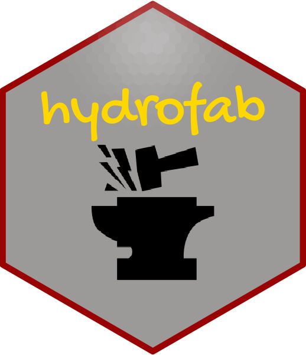
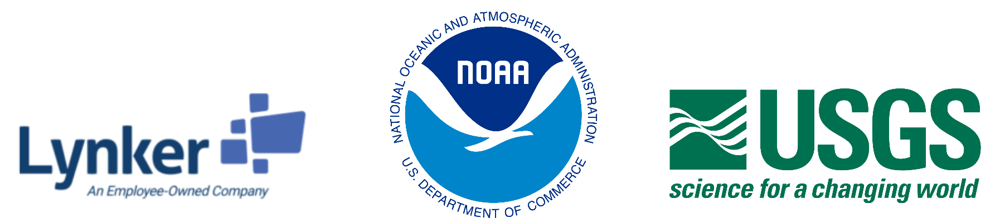

<!-- README.md is generated from README.Rmd. Please edit that file -->

```{r, include = FALSE}
options(width=100)
knitr::opts_chunk$set(
  # collapse = TRUE,
  # comment = "#>",
  # fig.path = "man/figures/",
  # out.width = "100%"
)
```

# hydrofab: Fabricating Hydrofabrics 

<!-- badges: start -->
[](https://github.com/mikejohnson51/hydrofab/actions/workflows/R-CMD-check.yml)
[](#)
[](https://choosealicense.com/licenses/apache-2.0/)
<!-- badges: end -->

The goal of `hydrofab` is to provide consistent hydrologic and hydraulic network manipulation tool chains to achieve model application ready datasets.

## Installation

You can install the development version of `hydrofab` like so:

```{r eval = FALSE}
install.packages("remotes")
remotes::install_github("NOAA-OWP/hydrofab")
```

### Refactoring and Aggregating

The concept of refactoring as intended here includes:

1) **Splitting** large or long catchments to create a more uniform catchment size
distribution,  
2) **collapsing** catchment topology to eliminate small catchments

The concept of aggregating as intended here includes **aggregating** catchments into groups based on existing network topology and defined criteria. Two primary use cases are offered:

1. Aggregating to a set of defined outlet locations
2. Merging catchments to a uniform size with enforced minimum areas and lengths.

This type of functionality is especially relevant to modeling applications that
need specific modeling unit characteristics but wish to preserve the network as
much as possible for interoperability with other applications 


```{r, eval = FALSE, echo = FALSE}
# knitr::include_graphics(c("man/figures/lynker-logo.png","man/figures/noaa-logo.png", 'man/figures/usgs-logo.png'))
# library(cowplot)
# xx = ggdraw() +
#   draw_image("man/figures/lynker-logo.png", width = 0.33,   height = .25) +
#   draw_image("man/figures/noaa-logo.png",   width = 0.33,   height = .35, x = 0.33) +
#   draw_image("man/figures/usgs-logo.png",   width = 0.33,   height = .25, x = .66) 
#  
# xx
# 
# cowplot::save_plot(xx, filename = "man/figures/logos.png")
``` 

```{r, fig.align='center', echo = FALSE}

```

## Questions:

<a href = "mailto:mike.johnson@noaa.gov?subject=Nexgen Hydrofabric Questions">
Mike Johnson</a> (NOAA Hydrofabric Lead)
 
## Disclaimer

These data are preliminary or provisional and are subject to revision. They are being provided to meet the need for timely best science. The data have not received final approval by the National Oceanic and Atmospheric Administration (NOAA) or the U.S. Geological Survey (USGS) and are provided on the condition that neither NOAA, the USGS, nor the U.S. Government shall be held liable for any damages resulting from the authorized or unauthorized use of the data.


